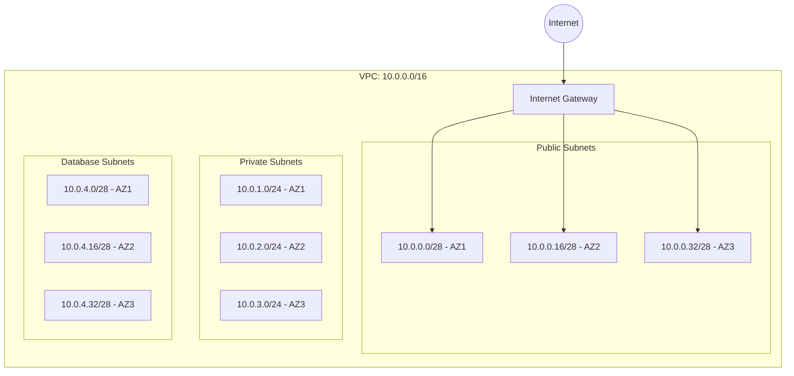

# AWS VPC Terraform Module

This Terraform module creates an AWS Virtual Private Cloud (VPC) with a 3-tier architecture across 3 availability zones. It includes public, private, and database subnets, as well as an Internet Gateway.

## Features

- VPC with customizable CIDR block
- Public, private, and database subnets distributed across availability zones
- Internet Gateway for public internet access
- Modular and reusable design

## Usage

```hcl
module "vpc" {
  source        = "./global/vpc"
  vpc_cidr      = "10.0.0.0/16"
  project_name  = "my-project"
  environment   = "stage"
}
```

## Resources Created

1. **VPC**
   - CIDR Block: Configurable via `vpc_cidr`
   - DNS Support: Enabled
   - DNS Hostnames: Enabled

2. **Subnets**
   - **Public Subnets**: 3 subnets across availability zones with public IPs
   - **Private Subnets**: 3 subnets for internal resources
   - **Database Subnets**: 3 subnets for databases with no public IPs

3. **Internet Gateway**
   - Attached to the VPC for internet access

## Inputs

| Name           | Description                           | Type   | Default     | Required |
|----------------|---------------------------------------|--------|-------------|----------|
| `vpc_cidr`     | CIDR block for the VPC               | string | `10.0.0.0/16` | yes      |
| `project_name` | Project name used in tags            | string | n/a         | yes      |
| `environment`  | Environment (e.g., stage, prod)      | string | n/a         | yes      |

## Outputs

| Name                | Description                     |
|---------------------|---------------------------------|
| `vpc_id`            | ID of the created VPC          |
| `public_subnet_ids` | IDs of the public subnets       |
| `private_subnet_ids`| IDs of the private subnets      |
| `database_subnet_ids`| IDs of the database subnets    |

## Network Topology


